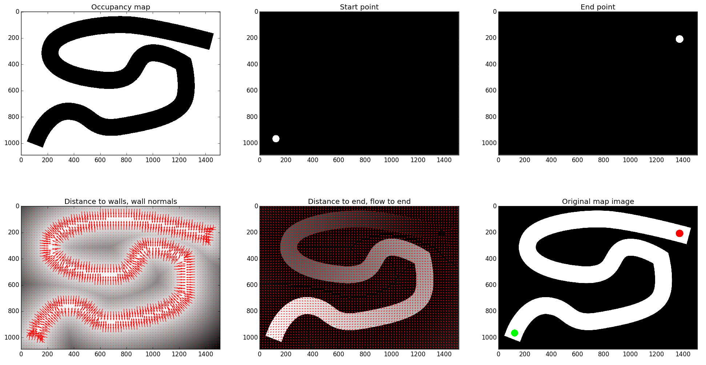
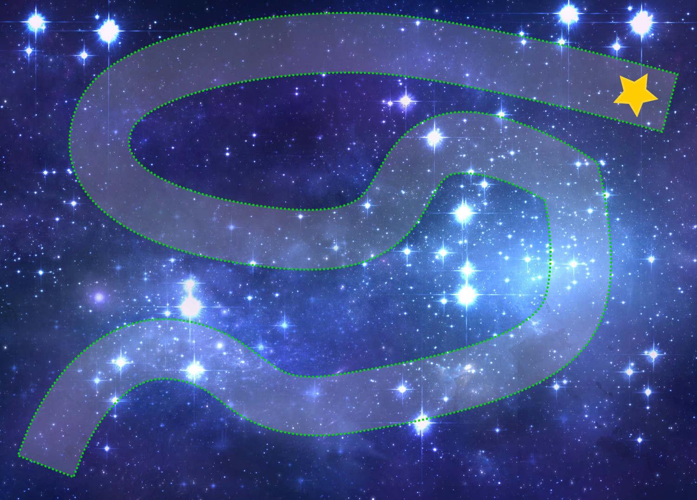

# spacerace

Multiplayer Asteroids-like racing game for the 2015 ETD winter retreat.

    docker build -t spacerace .
    docker run -it -p 5556-5559:5556-5559 spacerace 

# Payload Specifications

The primary state content for game will be stored within two JSON objects, a
Map, and a GameState. The following specifies the format of these JSON objects
for version `1.0`.

## Maps

The maps are raster data, and will be stored in a location separately to the
game server. The location and name of the map for the upcoming round will be
communicated by the game server once the player has connected.

The top level JSON object shall comprise:
- **TODO:** Lachy, you may want to check below:
- `version`: The version of the Map format, as a string. (e.g., `"1.0"`)
- `location`: The location and name where you can retrieve the map and
  associated information.

### Game Map Files

The following files are associated with each map (`.png` or any bitmap format,
`.csv.gz` are gzipped space-separated value files):
- `mapname.png` the actual track bitmap 
- `mapname_start.csv.gz` bitmask of the location(s) of the start
- `mapname_end.csv.gz` bitmask of the location(s) of the end
- `mapname_occupancy.csv.gz` bitmask of the obstacles
- `mapname_enddist.csv.gz` distance to nearest end (pixels)
- `mapname_flowx.csv.gz` flow-field to nearest end, unit vector horizontal
  component 
- `mapname_flowy.csv.gz` flow-field to nearest end, unit vector vertical
  component

Here is an example of this data (you will not have access to the track wall
normals/distance to walls);

### How to contribute a map

It's easy! For the actual track, you just need to create a bitmap (preferably
PNG but any image format will do) that conforms to the following
specifications:

- Occupied regions must be **black** `#000000, rgb(0, 0, 0)`
- Free/race track regions must be **white** `#FFFFFF, rgb(255, 255, 255)`
- Start position(s) must be **green** `#00FF00, rgb(0, 255, 0)`
- End position(s) must be **red** `#FF0000, 
  rgb(255, 0, 0)`

Also, we haven't put a constraint on the size, but I recommend less than 
1500px X 1500px. Here is an example:

To then make this map readable by the game engine, you need to run the
`buildmap.py` script in the `mapbuilder` directory. Here is an example (from
where you cloned this repo),

    $ cd mapbuilder
    $ ./buildmap pathto/yourmapname.png --visualise

This will then output all of the necessary files into the same directory as
your map. You can call `./buildmap.py --help` for more info. Also, have a look
at `mapbuilder/requirements.txt` for all of the required python packages.

Finally, you can optionally provide a skin for you map to make it look pretty!
Just make sure it is the same size as you original map and has the suffix
`_skin`, e.g.

##Lobby
TODO -- connect to lobby with a REQ socket. Send a message with an ascii string
containing your ships name. The server will send a reply with 2 frames -- the
first is a secret key used to make sure only you can control your ship, and the
second is the map specification for the next game.

Once this has happened you're ready to play, start listening on the game state
socket for the beginning of the game!

## GameState

Is a plain json object. There is one key **ships** - an array of 
Player State objects:

### Player State

- **id [string]** - The player's chosen identifier.
- **x, y** - position
- **vx, vy** - linear velocity
- **theta** - orientation
- **omega** - rotational velocity
- **Tl** - is accelerating (linear thrusters are on). `0 or 1`
- **Tr** - is rotating (rotational thrusters on). `-1 or 0 or 1`

All values are JSON Numbers - not strings.

## Control Input

Control messages are sent from a client to the server during a game via a
zeromq "push" socket. The control input is a simple comma separated string.
The string is of the form:

    <yoursecretkey>,<main_engine>,<rotation>

- `<yoursecretkey>` is the string you were given by the lobby upon connection
- `<main_engine>` is either a 0 or a 1, for the main engine being off or on
- `<rotation>` is either a -1, 0 or 1. 1 is for +ve (anti-clockwise) rotation
thrust, -1 is for -ve (clockwise) rotation thrust, and 0 is no rotation thrust

