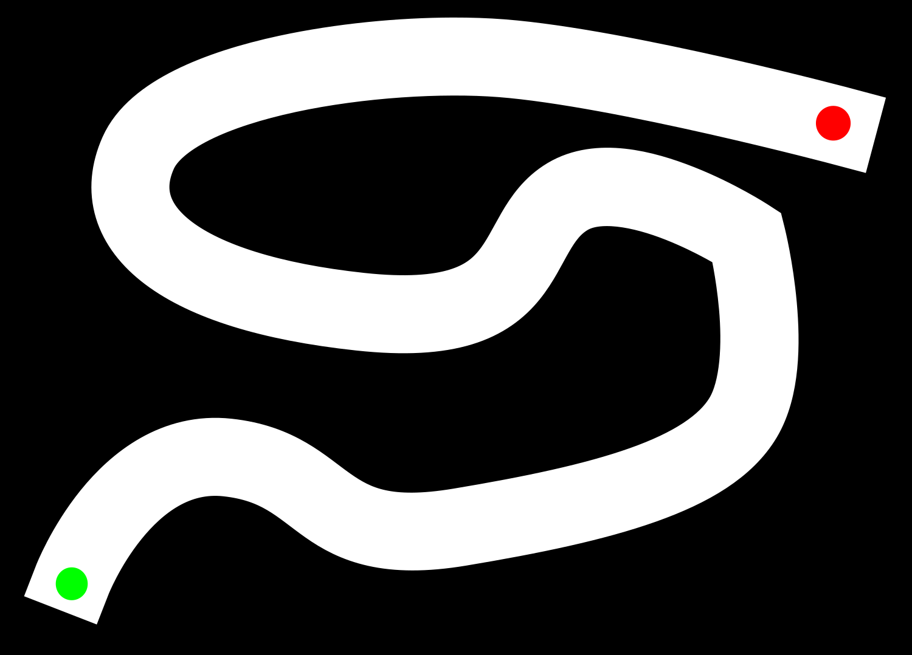

# spacerace

[](https://travis-ci.org/lmccalman/spacerace)

Spacerace is a multiplayer Asteroids-like racing game for the 2015 ETD winter
retreat.


## Overview

This is a multi-round racing game in which the game state is managed from a
central game server. The aim of this game is for the player's spaceship to
complete the track before anyone else's, and within the time limit of the
round. The round ends as soon as the first player reaches a finish, or the time
is up. Then each player is assigned a score which is the percentage of the
track they completed by the finish of the round. 

The game involves controlling a spaceship that has a main thruster to
accelerate it forward, and small rotational thrusters to spin it. The world is
2D and flat, and the ships encounter air resistance that limits their maximum
velocity and turn rate.

There is no friction on the track, and so ships behave much like a hovercraft.
However the walls are (semi) elastic, and the ships will bounce off them. Ships
can also collide with eachother without damage. Spin forces are reasonably well
approximated, so glancing off a wall or another ship can send your ship into a
spin.

Multiple ships can form a team, and the game keeps both a team score and an
individual ship score. Clients are welcome to add multiple ships to the game,
but the server may limit the total number of clients in a game or playing for a
particular team.

The game cycles through a list of different maps. If a player tries to join a
whilst a game is in progress, they will be added to the lobby for the next
game.

## Directory Structure

You may find some of the code in the following folders great inspiration for
your creations (particularly `clients`, `frontend` and `maps`).

``` console
spacerace
├── clients             # Example starter ZMQ and HTTP clients in Python
├── frontend            # Front end (node.js)
├── httpserver          # HTTP Server that exposes a RESTful API and communicates to the server with ZMQ, so you don't have to
├── mapbuilder          # Python script for building maps from bitmaps
├── maps                # A few example maps (`png`, `svg`, etc.)
├── physics             # Prototype implementation of the game physics in Python
└── server              # Server in C++, including physics engine, game management logic, etc.
```

## Coordinate System

We use the conventional Cartesian coordinate system (as opposed to the coordinate 
systems used in computer graphics). One unit in the coordinate frame is
equivalent to one pixel in the map of the current round. With respect to your
screen, the coordinate system is described below:


## General Instructions for Building a Client

### HTTP

There are three API endpoints a client must interact with:

1. *Lobby* (`GET /lobby`): register to participate in the next game.
2. *Game state* (`GET /state`): request the current game state.
3. *Control*  (`POST /control`): send control instructions.

#### Lobby endpoint

+ `/lobby`
    - `POST`
        + name (optional): player name
        + team (optional): team name
        + password (required): password

The lobby endpoint is used by players to join a game. The server starts and
begins to accept new players into the first game lobby. Some time later, when
the first game starts, the server creates the lobby for the second game. This
means that a player trying to join during a game will simply be placed in the
lobby for the next game.

To register to participate in the next game, a client must make a `POST` request
to the `/lobby` endpoint with parameters `name`, `team`, and `password`. You
must specify all three variables.

The name will be reflected in the state sent out by the server, and the
visualisation of your ship. The team is used to aggregate the scores of multiple
related AIs. The password is used to validate your control inputs. Don't share
your password unless you want others to take control of your ship!  Feel free
to choose any alphanumeric values for `name`, `team`, and `password` variables.

Example:

Register 'Giovanni' under 'Team Rocket':

```
$ curl -H "Content-Type: application/json" -X POST -d '{"name":"Giovanni","team":"Team Rocket","password":"spacexrules"}' http://127.0.0.1:5000/control
```

You will receive a JSON response with fields `name`, `game`, and `map`.

The name should be the name you gave the server. The game name is an important
variable required by the state endpoint, to make sure you're actually receiving
state for a game you're playing in. The map name will be the name of the map 
you'll be playing, and you will need to have pulled down these maps from the 
map server beforehand.

Once this you have received this response, you're ready to play the game. You
can now poll the appropriate state endpoint for your game ready for when the
game starts!

#### State endpoint

+ `/state`
    - `GET`
        + game: game name

The state endpoint gives the game state. The game state is the position, 
velocity, and control inputs of every ship currently playing. Note that other 
ship's state may be useful for collision avoidance!

To get the current game state, a client must make a `GET` request
to the `/state` endpoint with parameter `game` which is the name of the game 
you registered in.

The server updates the state periodically. The frequency of this update is set
on the server. Typical values are between 20Hz and 60Hz depending on the status
of the network.


Example:

The game state shows that game `game772` is currently running and `Giovanni` is
currently the only participant:

```
$ curl http://127.0.0.1:5000/state?game=game772
{
  "data": [
    {
      "Tl": 0, 
      "Tr": 0, 
      "id": "Giovanni", 
      "omega": 0, 
      "theta": 4.39718961715698, 
      "vx": 0, 
      "vy": 0, 
      "x": 1580.22705078125, 
      "y": 680.318725585938
    }
  ], 
  "state": "running"
}
```

The state message is a json object of the following form:

```
    {
        "state": "running",
        "data": {
            "name1": {
              [...]
            },
            "name2": {
              [...]
            },
            [...]
        }
    }
```

The state variable will be "running" while the game is running, and "finished"
when someone wins the game or it times out. Make sure you check the status
before you try to access the data member, because it isn't in the final
"finished" message

In the nested dictionary, each player has the following attributes:

```
    {
        "id": "ship_name",
        "x": <xposition in float>
        "y": <yposition in float>
        "vx": <x velocity in float>
        "vy": <y velocity in float>
        "theta": <heading in float>
        "omega": <angular velocity in float> 
        "Tl": <0 or 1 for linear thrust off/on>
        "Tr": <-1, 0 or 1 for angular thrust clockwise/off/ counter-clockwise>
    }
```

Note the the units of `x`, `y`, `theta` and `omega` all relate to pixels in the 
map. So an `x` position of 0.5 is half way into the first map pixel in the `x`
direction.

#### Control endpoint

+ `/control`
    - `POST`
        + password: your password
        + rotation: rotational thrust
        + linear: linear thrust

The control endpoint is used to send control commands for your ship during a
game. Commands are sent to `/control` via a `POST` method with JSON data 
containing fields `password`, `rotation`, `linear`. If you send control commands 
to a game you're not in, or while no game is running, they will be ignored.

A client can send control messages whenever they would like and as frequently
or infrequently as they would like, but the server will only process the last
message it received each timestep. So if you send 100 control inputs between
the server updating its state message, only the last one will actually be used
to control your ship.

Example:

The password we made for `Giovanni` was `spacexrules`. We can then send 
rotational thrust in the anti-clockwise direction (rotation=-1) with no linear 
thrust (linear=0) with a `POST` request:

```
$ curl -H "Content-Type: application/json" -X POST -d '{"password":"spacexrules","rotation":-1,"linear":0}' http://127.0.0.1:5000/control
```

- `<password>` is the password you gave the lobby upon connection
- `<linear>` is either a 0 or a 1, for the main engine being off or on
- `<rotation>` is either a -1, 0 or 1. 1 is for +ve (anti-clockwise) rotation
thrust, -1 is for -ve (clockwise) rotation thrust, and 0 is no rotation thrust

### ZeroMQ

A minimal client has three [ZeroMQ](http://zeromq.org/) sockets:

1. *Lobby*: a request socket, asks for a connection to the next game, receives 
confirmation of the next game that will be joined.
2. *Game state*: subscription ("sub") socket, receive a JSON object of the 
current games state (details below).
3. *Control*: a "push" socket, push your client control actions as a ZeroMQ
frame (see below for details).

There is an additional (optional) *info* socket that may send useful error and
status messages to debug clients.

The pseudo-code of a very simple single-threaded client is given below:

#### Pseudo code

    while(true) // loop that connects and plays in every round of the game
        send a connection message over the lobby socket
        receive a confirmation message from the lobby about your next game
        subscribe your state socket to the game name given by the lobby
        running = true
        while(running)
          receive the game state from the state socket
          send a control command on the control socket 
          set running = false if the game has finished

Each of these sockets, and the message formats they send and expect to receive,
are outlined in the following sections.


#### Ports

These are the ports for the various sockets:

- State: 5556
- Control: 5557
- Lobby: 5558
- Info: 5559


#### Lobby socket

The lobby socket is used by players to join a game. The server starts and
begins to accept new players into the first game lobby. Some time later, when
the first game starts, the server creates the lobby for the second game. This
means that a player trying to join during a game will simply be placed in the
lobby for the next game.

For clients, the lobby socket is a ZMQ "REQ" (request) socket. These operate
sychronously, requiring a request/reply message pattern.

Initialise your lobby socket, and connect to the server on the lobby port.
Then, send the following json message:

```
    { 
        "name": "yournamehere",
        "team": "yourteam",
        "secret": "yoursecretkey"
    }
```

The name will be reflected in the state sent out by the server, and the
visualisation of your ship. The team is used to collate the scores of multiple
related AIs. The secret is used to validate your control inputs. Don't share
your secret unless you want others to take control of your ship!  Feel free
to choose any alphanumeric values for `name`, `team`, and `secret` variables.

After sending your message, call receive on your lobby socket. The server
should send you a json message of the following form:

```
    {
        "name": "yournamehere",
        "game": "gamename",
        "map": "mapname",
    }
```

The name should be the name you gave the server, the game name is an important
variable used by the state socket, to make sure you're actually receiving state
for a game you're playing in. The map name will be the name of the map you'll
be playing, and you will need to have pulled down these maps from the map
server beforehand.

Once this request/reply sequence has completed, you're ready to play the game.
You'll know a game has started when you start receiving state over your state
socket.

#### State Socket

The state socket is a ZMQ "SUB" (subscribe) socket that is receive-only. It is
the socket over which the server broadcasts the game state. In this case, the
game state is the position, velocity, and control inputs of every ship
currently playing. Note that other ship's state may be useful for collision
avoidance!

ZMQ subscribe sockets can filter messages based on a string "subscription". The
server uses this feature to make sure players waiting in the lobby of a game to
not receive spurious game state for the game their not playing. Therefore it's
critical that once you have received the game name of your next game from the
lobby, you subscribe the state socket to this name. 

Some time later, you'll start receiving state messages on this socket,
indicating that the game has begun. The sever broadcasts the state
periodically. At the moment this happens at 60Hz but we may move this number
around on the day depending on the network.

The state message is a json object of the following form:

```
    {
        "state": "running",
        "data": [list_of_players]
    }
```

The state variable will be "running" while the game is running, and "finished"
when someone wins the game or it times out. Make sure you check the status
before you try to access the data member, because it isn't in the final
"finished" message

in the data array, each player has the following attributes:

```
    {
        "id": "shipname",
        "x": <xposition in float>
        "y": <yposition in float>
        "vx": <x velocity in float>
        "vy": <y velocity in float>
        "theta": <heading in float>
        "omega": <angular velocity in float> 
        "Tl": <0 or 1 for linear thrust off/on>
        "Tr": <-1, 0 or 1 for angular thrust clockwise/off/ counter-clockwise>
    }
```

Note the the units of x y, theta and omega all relate to pixels in the map.
So an x position of 0.5 is half way into the first map pixel in the x
direction.

#### Control Socket

The control socket is used to send control commands for your ship during a
game. It is a ZMQ PUSH socket that is send-only. If you send control commands
to a game you're not in, or while no game is running, they will be ignored.

A client can send control messages whenever they would like and as frequently
or infrequently as they would like, but the server will only process the last
message it received each timestep. So if you send 100 control inputs between
the server sending its state message, only the last one will actually be used
to control your ship.

The message format for control messages is not JSON for reasons of efficiency.
It is a simple CSV format in a single short string, of the following form:

```
    <yoursecretkey>,<main_engine>,<rotation>
```

- `<yoursecretkey>` is the string you were given by the lobby upon connection
- `<main_engine>` is either a 0 or a 1, for the main engine being off or on
- `<rotation>` is either a -1, 0 or 1. 1 is for +ve (anti-clockwise) rotation
thrust, -1 is for -ve (clockwise) rotation thrust, and 0 is no rotation thrust


#### Info Socket

This is an additional socket that is essentially just a way for the server to 
send messages to all players that are not game-state critical. This includes
things like:
 * Malformed messages
 * Current round scores (players who are closest to an end)
 * Final round scores
 * Other potentially useful stuff

This is just a ZeroMQ subscribe socket, simply subscribe to "" (empty string)
to *get everything* - i.e. this is a fire-hose (you will be getting everyone's
malformed messages)! All messages are JSON objects with obvious formatting.

You don't have to explicitly write code to view messages on this socket, have a
look at
[clients/python/log_client.py](https://github.com/lmccalman/spacerace/blob/master/clients/python/log_client.py)
for a terminal client that subscribes to, and prints messages from this socket.


## Physics Engine

The state of each ship is 6 dimensional - positions *x*, *y*, velocities *v_x*,
*v_y*, and the orientation and angular rate *theta* and *omega = dtheta/dt*.

The server implements drag, and simple collision physics with friction.

Ships are radius 10 game units about their center. Thus they will collide with
each other when their centers are 20 game units apart, or with barriers when the
center is 10 units from a boundary. Collisions are implemented in simulation by
applying elastic forces.

Upon colliding, ships also experience surface friction. Depending on the
relative surface velocities at the contact point, forces and torques are
imparted on the ships - spin affects your bounce direction, and bounce affects
imparted spin.


## Maps

The maps are raster data, and will be stored in a location that we will
communicate on the day. The map name that will be in the next round is
communicated upon connection to the lobby in the confirmation JSON object (the
"map" property), see point **2** above.

It is then up to you to download the map information from the supplied
location. There are a number of bitmap and (compressed) CSV files that convey
different information about the upcoming round that you may find useful
(especially for path planning).

Also, if you don't feel like making an AI, please have a go at making a map, or
even a front-end to visually display the game state!


### Game Map Files

The following files are associated with each map. There are two file types,
`.png` or any bitmap format and `.csv.gz` are gzipped space-separated 32-bit 
float value files:
- `mapname.png` the actual track bitmap 
- `mapname_start.csv.gz` {1.0, 0.0} values indicating the location(s) of the 
    start
- `mapname_end.csv.gz` {1.0, 0.0} values indicating the location(s) of the end
- `mapname_occupancy.csv.gz` {1.0, 0.0} values indicating the obstacles
- `mapname_enddist.csv.gz` distance to nearest end (pixels)
- `mapname_flowx.csv.gz` flow-field to nearest end, unit vector horizontal
  component 
- `mapname_flowy.csv.gz` flow-field to nearest end, unit vector vertical
  component

Here is an example of this data (you will not have access to the track wall
normals/distance to walls);


### How to contribute a map

It's easy! For the actual track, you just need to create a bitmap (preferably
PNG but any image format will do) that conforms to the following
specifications:

- Occupied regions must be **black** `#000000, rgb(0, 0, 0)`
- Free/race track regions must be **white** `#FFFFFF, rgb(255, 255, 255)`
- Start position(s) must be **green** `#00FF00, rgb(0, 255, 0)`
- End position(s) must be **red** `#FF0000, 
  rgb(255, 0, 0)`

Also, we haven't put a constraint on the size, but I recommend less than 
1500px X 1500px. Here is an example:



To then make this map readable by the game engine, you need to run the
`buildmap.py` script in the `mapbuilder` directory. We have already built a
Docker image that installs all the dependencies and pushed it to Docker Hub.

``` console
$ docker run -it -v <spacerace-root>/config:/usr/src/app/config \
>                -v <spacerace-root>/maps:/usr/src/app/maps \
>                terriajs/spacerace-mapbuilder:latest maps/etd-winter-retreat-2015/bt-circle1.png
Reading and processing map image 'maps/etd-winter-retreat-2015/bt-circle1.png'...
Calculating distance to walls...
Calculating flow field to end...
Calculating wall normals...
Saving results...
  - padded image
  - binary layers
  - csv layers
Done!
```

This will then output all of the necessary files into the same directory as
your map. 

For additional information, use the `--help` flag:

``` console
$ docker run -it terriajs/spacerace-mapbuilder:latest --help
Usage: buildmap.py [OPTIONS] IMAGE

Options:
  --mapname TEXT       Output map file name, same as IMAGE.npy unless
                       specified.
  --settingsfile TEXT  Location of the spacerace settings JSON file.
  --visualise          Visualise the output?
  --help               Show this message and exit.
```

Finally, you can optionally provide a skin for you map to make it look pretty!
Just make sure it is the same size as your original map and has the suffix
`_skin`, e.g.


Now just upload all of the generated files to the location we will specify!

#### Recipes

From the spacerace project root, build all maps (files ending in `.png` but not
`_skin.png` or `_padded.png`) in the `maps/` directory:

``` console
$ find maps -maxdepth 2 -type f -name "*.png" \
>           -not -name "*_padded.png" \
>           -not -name "*_skin.png" \
>           -exec mapbuilder/buildmap.py {} \;
```

# Frontend

The server runs a simple html visualization on port `8000`. This includes
a rendering of the current game - with current scores, a list of players 
in the lobby, and a global score board. Data is piped from ZeroMQ to
websockets at 60Hz and the `SVG` rendering is done with the `d3` library.

## Creating another frontend

There are two options for creating another front end; either directly 
connecting to the *State* and *Info* zeroMQ sockets, or by using `socket.io`
websockets.


# Building Your Own Server

You may wish to build the server on your local machine to ease debugging and not
be subject to network outages. The Spacerace server and related services such as
the frontend and HTTP server are all deployed with Docker and Docker Compose. We
use [version 2](https://docs.docker.com/compose/compose-file/#versioning) of the 
Compose file format, so all you require are:

- Docker Engine (version 1.10.0+)
- Compose 1.6.0+

First you should obtain the maps. The bitmaps are stored on Git LFS (Large File
Storage) so you can fetch them and build them yourself (instructions above), but
this can be time consuming. We have prebuilt all the maps and stored the generated
files (flow fields, occupancy maps, etc.) in an S3 bucket: 
https://s3-ap-southeast-2.amazonaws.com/spacerace-artifacts/maps.tar.gz. We 
recommend you download and extract all the maps and associated files to the 
`maps/` directory in the spacerace project root.

``` console
$ wget https://s3-ap-southeast-2.amazonaws.com/spacerace-artifacts/maps.tar.gz
$ tar xvzf maps.tar.gz
```

Once the maps are in place, you can build and start the server:

``` console
$ docker-compose up
Starting spacerace_server_1
Starting spacerace_frontend_1
Starting spacerace_httpserver_1
[...] # very verbose logging that won't fit here
```

You can also use the `-d` flag to start it in detached mode:

``` console
$ docker-compose up -d
Starting spacerace_server_1
Starting spacerace_frontend_1
Starting spacerace_httpserver_1
```

You can see how the containers and how the ports have been forwarded with the `ps`
subcommand:

``` console
$ docker-compose ps
             Name                           Command                           State                            Ports
---------------------------------------------------------------------------------------------------------------------------------
spacerace_frontend_1             /bin/sh -c sleep 10s && no ...   Up                               0.0.0.0:8000->8000/tcp
spacerace_httpserver_1           gunicorn --workers 5 --bin ...   Up                               0.0.0.0:5001->5001/tcp
spacerace_server_1               /spacerace/spacerace-serve ...   Up                               0.0.0.0:5556->5556/tcp,
                                                                                                   0.0.0.0:5557->5557/tcp,
                                                                                                   0.0.0.0:5558->5558/tcp,
                                                                                                   0.0.0.0:5559->5559/tcp
```

Now you should be able to see the frontend at http://0.0.0.0:8000, the HTTP server
at http://0.0.0.0:5001, and communicate with the various ZMQ sockets at the listed
ports. 

If you are using Docker Machine (Mac and Windows users), the address will be 
`$(docker-machine ip default)` instead of `0.0.0.0`/`localhost`. E.g. if

``` console
$ docker-machine ip default
192.168.99.100
```

You should be able to see the frontend at http://192.168.99.100:8000/

You can view the logs with the `logs` subcommand:

``` console
$ docker-compose logs
[...] # very verbose logging that won't fit here
```

Finally, to stop all the containers:

``` console
$ docker-compose stop
Stopping spacerace_httpserver_1 ... done
Stopping spacerace_frontend_1 ... done
Stopping spacerace_server_1 ... done
```

